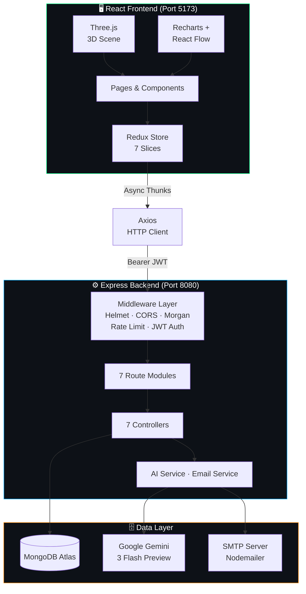
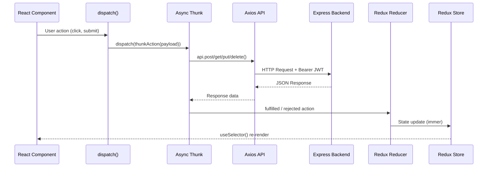
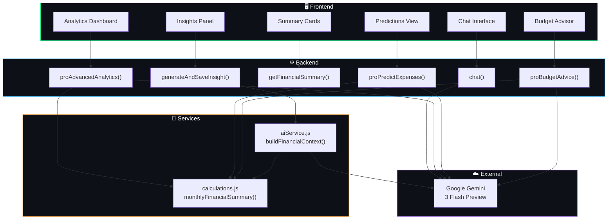
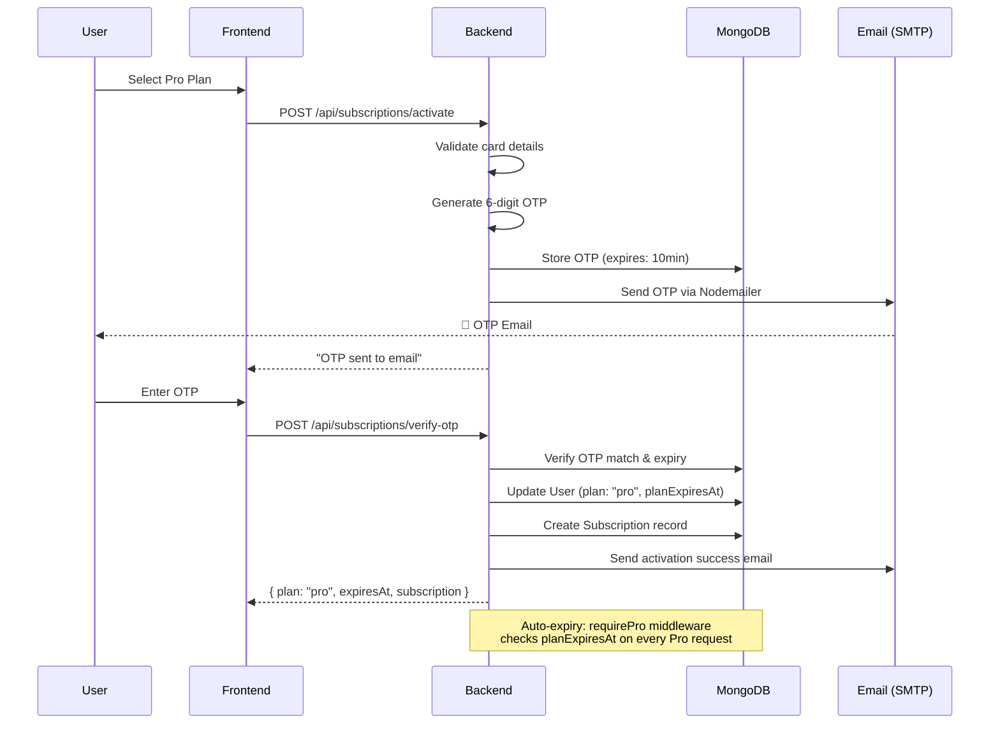

<p align="center">
  
  
  
  
</p>

<h1 align="center">💰 AI Income Tracker</h1>

<p align="center">
  <strong>AI-Powered Personal Finance Dashboard with 3D Visualizations</strong><br/>
  Full-stack MERN fintech application with Google Gemini AI integration, real-time analytics,<br/>
  interactive money-flow diagrams, and immersive Three.js rendering.
</p>

<p align="center">
  <a href="#-quick-start">Quick Start</a> •
  <a href="#-live-features">Features</a> •
  <a href="#-tech-stack">Tech Stack</a> •
  <a href="#-api-documentation">API Docs</a> •
  <a href="#-architecture">Architecture</a>
</p>

---

## 📋 Project Overview

**AI Income Tracker** is a production-grade personal finance management platform that combines traditional income/expense tracking with AI-powered financial intelligence. Built on the MERN stack, it delivers real-time insights, predictive analytics, and budget recommendations through Google's Gemini 3 Flash model.

### Who is it for?

- Individuals managing multiple income streams
- Freelancers tracking project-based income and recurring expenses
- Anyone seeking AI-driven financial guidance without switching platforms

### What problems does it solve?

| Problem | Solution |
|---------|----------|
| Manual spreadsheet tracking | Automated categorization with 15+ transaction categories |
| No spending visibility | 8+ chart types: area, pie, scatter, radar, composed, bar, line |
| Generic financial advice | AI-personalized insights based on your actual transaction data |
| Disconnected finance tools | Unified dashboard: income, expenses, savings, loans, subscriptions |
| Static dashboards | Interactive React Flow money-flow diagrams + 3D coin animations |

---

## ✨ Live Features

### Core Modules

| Module | Description |
|--------|-------------|
| **Authentication** | JWT-based registration/login with bcrypt password hashing (salt rounds: 12). Token persisted in localStorage with Axios interceptor auto-injection. |
| **Income Tracking** | Full CRUD for income records with source attribution, date tracking, and multi-currency support (USD, EUR, GBP, INR, JPY, CAD, AUD, PKR). |
| **Transaction Management** | Income/expense logging across 15 categories: `food`, `rent`, `shopping`, `investment`, `utilities`, `transport`, `healthcare`, `education`, `entertainment`, `salary`, `freelance`, `business`, `loan_payment`, `savings_deposit`, `other`. |
| **Savings Goals** | Monthly savings tracking with target amounts, progress percentage (virtual field), title, and deadline. Unique constraint on `userId + year + month`. |
| **Loan & EMI Tracking** | Loan lifecycle management with remaining amount computation, update/delete operations, and dashboard integration. |
| **AI Finance Assistant** | Chat with Gemini 3 Flash, generate monthly insights, get financial summaries. Free: 5 AI requests/day. Pro: unlimited. |
| **Financial Predictions** | *(Pro)* AI-generated expense predictions by category with confidence scoring and trend analysis. |
| **Budget Advice Generator** | *(Pro)* Personalized budget recommendations with spending goal tracking and actionable advice. |
| **Advanced Analytics** | *(Pro)* Deep spending breakdowns, category-level analysis, daily spending patterns, and comparative metrics. |
| **Subscription System** | Two-step OTP verification (email via Nodemailer), plan management, subscription history, auto-expiry handling. |

### Premium (Pro) Features

| Feature | Free | Pro |
|---------|:----:|:---:|
| AI Requests / Day | 5 | ∞ |
| Insight History | 10 | ∞ |
| Advanced Analytics | ✗ | ✓ |
| Category Predictions | ✗ | ✓ |
| Budget Alerts & Advice | ✗ | ✓ |
| Data Export (PDF) | ✗ | ✓ |

---

## 🛠 Tech Stack

### Frontend

| Layer | Technology | Version |
|-------|-----------|---------|
| Framework | React | 19.2.4 |
| Build Tool | Vite | 7.3.1 |
| State Management | Redux Toolkit | 2.11.2 |
| Routing | React Router DOM | 7.13.1 |
| Styling | TailwindCSS (CDN) | 3.x |
| HTTP Client | Axios | 1.13.6 |
| Charts | Recharts | 3.7.0 |
| Flow Diagrams | @xyflow/react | 12.10.1 |
| 3D Rendering | Three.js + @react-three/fiber | 0.183.2 / 9.5.0 |
| 3D Helpers | @react-three/drei | 10.7.7 |
| Animation (imperative) | GSAP | 3.14.2 |
| Animation (declarative) | Framer Motion | 12.34.4 |
| Icons | Lucide React | 0.576.0 |
| PDF Generation | jsPDF | 4.2.0 |
| Markdown Rendering | react-markdown | 10.1.0 |
| Notifications | react-hot-toast | 2.6.0 |

### Backend

| Layer | Technology | Version |
|-------|-----------|---------|
| Runtime | Node.js | 20+ |
| Framework | Express.js | 5.2.1 |
| Database | MongoDB + Mongoose | 9.2.2 |
| Authentication | JSON Web Tokens | 9.0.3 |
| Password Hashing | bcryptjs | 3.0.3 |
| AI Provider | Google Gemini (@google/genai) | 1.43.0 |
| Email Service | Nodemailer | 8.0.1 |
| Security | Helmet | 8.1.0 |
| Rate Limiting | express-rate-limit | 8.2.1 |
| Logging | Morgan | 1.10.1 |
| CORS | cors | 2.8.6 |

---

## 🏗 Architecture

### System Architecture



### Frontend Architecture

```mermaid
flowchart LR
    subgraph Pages["📄 Pages"]
        Dashboard
        Income
        Transactions
        Savings
        Loans
        AI["AI Assistant"]
        Subscription
        Profile
        Login
        Register
    end

    subgraph Components["🧩 Components"]
        DashboardLayout
        Sidebar
        ProtectedRoute
        FinanceScene["FinanceScene (3D)"]
        UI["UI Primitives"]
    end

    subgraph State["🔄 Redux Slices"]
        authSlice
        incomeSlice
        transactionSlice
        savingsSlice
        loanSlice
        aiSlice
        subscriptionSlice
    end

    subgraph API["📡 API Layer"]
        apiService["services/api.js<br/>Axios Instance"]
    end

    Pages --> Components
    Pages --> State
    State -->|"createAsyncThunk"| apiService
    apiService -->|"HTTP + JWT"| Backend["Express API"]

    style Pages fill:#0d1117,stroke:#00ff88,color:#fff
    style Components fill:#0d1117,stroke:#aa55ff,color:#fff
    style State fill:#0d1117,stroke:#00aaff,color:#fff
    style API fill:#0d1117,stroke:#ff8800,color:#fff
```



### Backend Architecture

```mermaid
flowchart LR
    subgraph Routes["🛣️ Routes"]
        authR["authRoutes"]
        incomeR["incomeRoutes"]
        txR["transactionRoutes"]
        savingsR["savingsRoutes"]
        loanR["loanRoutes"]
        aiR["aiRoutes"]
        subR["subscriptionRoutes"]
    end

    subgraph Middleware["🛡️ Middleware"]
        protect["protect (JWT)"]
        requirePro["requirePro"]
        aiRate["aiRateLimit"]
    end

    subgraph Controllers["⚡ Controllers"]
        authC["authController"]
        incomeC["incomeController"]
        txC["transactionController"]
        savingsC["savingsController"]
        loanC["loanController"]
        aiC["aiController"]
        subC["subscriptionController"]
    end

    subgraph Models["📦 Mongoose Models"]
        User
        IncomeM["Income"]
        TransactionM["Transaction"]
        SavingsM["Savings"]
        LoanM["Loan"]
        InsightM["Insight"]
        SubscriptionM["Subscription"]
        OTPM["OTP"]
    end

    subgraph Services["🔌 Services"]
        aiSvc["aiService"]
        emailSvc["emailService"]
    end

    Routes --> Middleware
    Middleware --> Controllers
    Controllers --> Models
    Controllers --> Services
    Models --> DB[(MongoDB)]
    Services --> Gemini["Gemini AI"]
    Services --> SMTP["SMTP"]

    style Routes fill:#0d1117,stroke:#00ff88,color:#fff
    style Middleware fill:#0d1117,stroke:#ff4466,color:#fff
    style Controllers fill:#0d1117,stroke:#00aaff,color:#fff
    style Models fill:#0d1117,stroke:#ff8800,color:#fff
    style Services fill:#0d1117,stroke:#aa55ff,color:#fff
```



---

## 🔄 State Management Flow



**7 Redux slices** manage the entire application state:

| Slice | Key State | Async Thunks |
|-------|-----------|-------------|
| `authSlice` | `user`, `token`, `isAuthenticated` | `register`, `login`, `loadUser`, `logout` |
| `incomeSlice` | `items[]`, `loading`, `error` | `getIncomes`, `addIncome`, `updateIncome`, `deleteIncome` |
| `transactionSlice` | `items[]`, `loading`, `error` | `getTransactions`, `addTransaction`, `updateTransaction`, `deleteTransaction` |
| `savingsSlice` | `items[]`, `loading` | `getSavings`, `upsertSavings`, `deleteSavings` |
| `loanSlice` | `items[]`, `loading` | `getLoans`, `addLoan`, `updateLoan`, `deleteLoan` |
| `aiSlice` | `insights`, `summary`, `analytics`, `predictions`, `budget`, `chat` | `fetchInsights`, `fetchSummary`, `fetchAnalytics`, `fetchPredictions`, `fetchBudget`, `sendChat` |
| `subscriptionSlice` | `status`, `plans`, `history` | `getStatus`, `getPlans`, `activate`, `verifyOTP`, `cancel` |

---

## 🎨 Animation System

AI Income Tracker uses a **three-layer animation architecture** where each technology handles a specific concern:

### Layer 1: GSAP — Imperative DOM Animations

```
Purpose: High-performance entrance animations and scroll-triggered reveals
```

| Usage | Location | Technique |
|-------|----------|-----------|
| Login/Register form entrance | `Login.jsx`, `Register.jsx` | `gsap.fromTo()` on mount via `useEffect` + `useRef` |
| Dashboard card stagger | `Dashboard.jsx` | Sequential `delay` props on StatCard components |
| Scroll reveals | Various pages | GSAP ScrollTrigger integration |

### Layer 2: Framer Motion — Declarative React Animations

```
Purpose: Component lifecycle animations tied to React's render cycle
```

| Usage | Location | Technique |
|-------|----------|-----------|
| Page transitions | All pages via layout | `motion.div` with `initial`, `animate`, `exit` |
| Card hover effects | `GlassCard`, `StatCard` | `whileHover`, `whileTap` transforms |
| List item stagger | Transaction lists, savings goals | `motion.div` with `transition.delay` |
| Modal/panel slide-in | Dashboard detail panel | `AnimatePresence` + `motion.div` width animation |
| Progress bars | Savings goals | `motion.div` animate `width` from 0 to target |

### Layer 3: Three.js — WebGL 3D Rendering

```
Purpose: Immersive financial visualizations rendered on GPU
```

| Element | Description | Implementation |
|---------|-------------|----------------|
| Floating Coins | Rotating metallic cylinders with neon-green emission | `@react-three/fiber` mesh + `useFrame` rotation |
| Particle System | 50 floating particles with ambient drift | Custom `points` geometry with `Float32Array` positions |
| Sparkles | Ambient sparkle overlay | `@react-three/drei` `<Sparkles>` component |
| Camera Movement | Smooth orbital motion | `useFrame` clock-based position updates |

**How the layers compose:**

```
┌─────────────────────────────────────────┐
│  Three.js Canvas (background 3D scene)  │  ← GPU-rendered, runs at 60fps
├─────────────────────────────────────────┤
│  Framer Motion (component animations)   │  ← React lifecycle, declarative
├─────────────────────────────────────────┤
│  GSAP (entrance & scroll animations)    │  ← Imperative, timeline-based
├─────────────────────────────────────────┤
│  TailwindCSS (transitions & hover)      │  ← CSS-native, zero JS overhead
└─────────────────────────────────────────┘
```

---

## 🤖 AI System

### AI Architecture



### AI Capabilities

| Feature | Endpoint | Plan | Description |
|---------|----------|------|-------------|
| Open Chat | `POST /api/ai/chat` | Public | Ask any financial question to Gemini |
| Generate Insight | `POST /api/ai/generate` | Free (5/day) | AI-analyzed monthly insight saved to database |
| Insight History | `GET /api/ai/insights` | Free | Retrieve stored AI insights with filtering |
| Financial Summary | `GET /api/ai/summary` | Free | Computed summary: income, expenses, savings rate, net balance |
| Advanced Analytics | `GET /api/ai/pro/analytics` | Pro | Deep category breakdown with AI commentary |
| Expense Predictions | `POST /api/ai/pro/predict` | Pro | Next-month expense predictions by category |
| Budget Advice | `POST /api/ai/pro/budget-advice` | Pro | Personalized budget plan with spending goals |

### Data Flow

1. **User selects month/year** → Frontend sends `{ month, year }` params
2. **Backend aggregates data** → `monthlyFinancialSummary()` queries Income, Transaction, Savings, Loan models
3. **Context built** → `buildFinancialContext()` structures data into a natural language prompt
4. **AI processes** → Prompt sent to Gemini 3 Flash Preview via `@google/genai`
5. **Response formatted** → Backend structures JSON response with parsed insights
6. **Frontend renders** → ReactMarkdown renders AI text, StatCards display metrics

---

## 🔐 Subscription Flow



### Subscription Lifecycle

| Step | Action | Backend Handler |
|------|--------|----------------|
| 1 | View available plans | `GET /api/subscriptions/plans` |
| 2 | Check current status | `GET /api/subscriptions/status` |
| 3 | Initiate activation | `POST /api/subscriptions/activate` → sends OTP email |
| 4 | Verify OTP | `POST /api/subscriptions/verify-otp` → activates Pro |
| 5 | Resend OTP (if expired) | `POST /api/subscriptions/resend-otp` |
| 6 | Cancel subscription | `POST /api/subscriptions/cancel` |
| 7 | View history | `GET /api/subscriptions/history` |

### Feature Gating

The `requirePro` middleware runs before every Pro-only route:

```
Request → protect (JWT) → requirePro → Controller
                              │
                    ┌─────────┴──────────┐
                    │ plan === "pro"?     │
                    │ planExpiresAt > now?│
                    └────────────────────┘
                         │           │
                        YES          NO → 403 + upgrade prompt
                         │
                    Next middleware
```

---

## 📡 API Documentation

**Base URL:** `http://localhost:8080/api`

All protected routes require: `Authorization: Bearer <JWT_TOKEN>`

### Authentication

| Method | Endpoint | Auth | Description |
|--------|----------|------|-------------|
| `POST` | `/auth/register` | Public | Register new user. Body: `{ name, email, password, currency? }` |
| `POST` | `/auth/login` | Public | Login. Body: `{ email, password }`. Returns JWT token. |
| `GET` | `/auth/me` | Protected | Get authenticated user profile. |

### Income

| Method | Endpoint | Auth | Description |
|--------|----------|------|-------------|
| `GET` | `/income` | Protected | Get all income records for authenticated user. |
| `POST` | `/income` | Protected | Create income record. Body: `{ source, amount, date?, description? }` |
| `GET` | `/income/:id` | Protected | Get single income record by ID. |
| `PUT` | `/income/:id` | Protected | Update income record. |
| `DELETE` | `/income/:id` | Protected | Delete income record. |

### Transactions

| Method | Endpoint | Auth | Description |
|--------|----------|------|-------------|
| `GET` | `/transactions` | Protected | Get all transactions. |
| `POST` | `/transactions` | Protected | Create transaction. Body: `{ title, amount, type, category, date? }` |
| `GET` | `/transactions/:id` | Protected | Get single transaction. |
| `PUT` | `/transactions/:id` | Protected | Update transaction. |
| `DELETE` | `/transactions/:id` | Protected | Delete transaction. |

### Savings

| Method | Endpoint | Auth | Description |
|--------|----------|------|-------------|
| `GET` | `/savings` | Protected | Get all savings goals. |
| `POST` | `/savings` | Protected | Upsert savings. Body: `{ savedAmount, targetAmount, month, year, title?, deadline? }` |
| `DELETE` | `/savings/:id` | Protected | Delete savings record. |

### Loans

| Method | Endpoint | Auth | Description |
|--------|----------|------|-------------|
| `GET` | `/loans` | Protected | Get all loans. |
| `POST` | `/loans` | Protected | Create loan. Body: `{ title, amount, remainingAmount?, interestRate?, emiAmount? }` |
| `GET` | `/loans/:id` | Protected | Get single loan. |
| `PUT` | `/loans/:id` | Protected | Update loan. |
| `DELETE` | `/loans/:id` | Protected | Delete loan. |

### AI

| Method | Endpoint | Auth | Description |
|--------|----------|------|-------------|
| `POST` | `/ai/chat` | Public | Chat with Gemini AI. Body: `{ question }` |
| `POST` | `/ai/generate` | Protected + Rate Limit | Generate AI insight. Body: `{ month, year }` |
| `GET` | `/ai/insights` | Protected | Get saved insights. Query: `?month=&year=` |
| `GET` | `/ai/summary` | Protected | Get financial summary. Query: `?month=&year=` |
| `GET` | `/ai/pro/analytics` | Pro | Advanced analytics. Query: `?month=&year=` |
| `POST` | `/ai/pro/predict` | Pro | Predict expenses. Body: `{ month, year }` |
| `POST` | `/ai/pro/budget-advice` | Pro | Budget advice. Body: `{ month, year, goal? }` |

### Subscriptions

| Method | Endpoint | Auth | Description |
|--------|----------|------|-------------|
| `GET` | `/subscriptions/plans` | Public | List available plans and pricing. |
| `GET` | `/subscriptions/status` | Protected | Get current subscription status & usage. |
| `POST` | `/subscriptions/activate` | Protected | Start Pro activation (sends OTP). |
| `POST` | `/subscriptions/verify-otp` | Protected | Verify OTP and activate Pro. |
| `POST` | `/subscriptions/resend-otp` | Protected | Resend expired OTP. |
| `POST` | `/subscriptions/cancel` | Protected | Cancel active subscription. |
| `GET` | `/subscriptions/history` | Protected | Get subscription history. |

---

## 🚀 Quick Start

### Prerequisites

- **Node.js** 20+ and **npm** 9+
- **MongoDB** instance (Atlas or local)
- **Google Gemini API Key** — [Get one here](https://ai.google.dev/)

### 1. Clone the Repository

```bash
git clone https://github.com/your-username/ai-income-tracker.git
cd ai-income-tracker
```

### 2. Backend Setup

```bash
cd backend
npm install
```

Create `.env` in the `backend/` directory:

```env
PORT=8080
MONGO_URI=mongodb+srv://<username>:<password>@cluster.mongodb.net/income-tracker
JWT_SECRET=your_super_secret_jwt_key_here
GEMINI_API_KEY=your_google_gemini_api_key
EMAIL_HOST=smtp.gmail.com
EMAIL_PORT=587
EMAIL_USER=your_email@gmail.com
EMAIL_PASS=your_app_specific_password
```

Start the server:

```bash
npm run dev      # Development (nodemon)
npm start        # Production
```

### 3. Frontend Setup

```bash
cd frontend
npm install
```

Start the development server:

```bash
npm run dev      # Starts at http://localhost:5173
```

### 4. Build for Production

```bash
cd frontend
npm run build    # Outputs to frontend/dist/
npm run preview  # Preview production build
```

---

## 🔑 Environment Variables

| Variable | Required | Description |
|----------|:--------:|-------------|
| `PORT` | ✓ | Backend server port (default: `8080`) |
| `MONGO_URI` | ✓ | MongoDB connection string |
| `JWT_SECRET` | ✓ | Secret key for JWT signing (use 256-bit random string) |
| `GEMINI_API_KEY` | ✓ | Google Gemini API key for AI features |
| `EMAIL_HOST` | ✓ | SMTP host for OTP emails (e.g., `smtp.gmail.com`) |
| `EMAIL_PORT` | ✓ | SMTP port (typically `587` for TLS) |
| `EMAIL_USER` | ✓ | SMTP authentication email address |
| `EMAIL_PASS` | ✓ | SMTP password or app-specific password |

---

## 📁 Folder Structure

```
ai-income-tracker/
├── backend/
│   ├── config/
│   │   └── db.js                    # MongoDB connection
│   ├── controllers/
│   │   ├── aiController.js          # AI chat, insights, analytics, predictions, budget
│   │   ├── authController.js        # Register, login, getMe
│   │   ├── incomeController.js      # Income CRUD
│   │   ├── loanController.js        # Loan CRUD
│   │   ├── savingsController.js     # Savings upsert, get, delete
│   │   ├── subscriptionController.js # Plan management, OTP flow
│   │   └── transactionController.js # Transaction CRUD
│   ├── middleware/
│   │   ├── authMiddleware.js        # JWT verification (protect)
│   │   └── proMiddleware.js         # Pro plan gating + AI rate limiting
│   ├── models/
│   │   ├── Income.js                # Income schema
│   │   ├── Insight.js               # AI insight storage
│   │   ├── Loan.js                  # Loan schema
│   │   ├── OTP.js                   # OTP with expiry
│   │   ├── Savings.js               # Savings with progress virtual
│   │   ├── Subscription.js          # Subscription with daysRemaining virtual
│   │   ├── Transaction.js           # Transaction with 15 category enum
│   │   └── User.js                  # User with plan, currency, AI usage tracking
│   ├── routes/
│   │   ├── aiRoutes.js              # /api/ai/*
│   │   ├── authRoutes.js            # /api/auth/*
│   │   ├── incomeRoutes.js          # /api/income/*
│   │   ├── loanRoutes.js            # /api/loans/*
│   │   ├── savingsRoutes.js         # /api/savings/*
│   │   ├── subscriptionRoutes.js    # /api/subscriptions/*
│   │   └── transactionRoutes.js     # /api/transactions/*
│   ├── services/
│   │   ├── aiService.js             # Gemini AI context builder + insight generator
│   │   └── emailService.js          # OTP generation + email sending via Nodemailer
│   ├── utils/
│   │   └── calculations.js          # monthlyFinancialSummary aggregation
│   ├── server.js                    # Express app entry point
│   └── package.json
│
├── frontend/
│   ├── public/                      # Static assets
│   ├── src/
│   │   ├── app/
│   │   │   └── store.js             # Redux store configuration
│   │   ├── components/
│   │   │   ├── DashboardLayout.jsx  # Sidebar + Outlet layout wrapper
│   │   │   ├── FinanceScene.jsx     # Three.js 3D scene (coins, particles, sparkles)
│   │   │   ├── ProtectedRoute.jsx   # Auth guard with loading spinner
│   │   │   ├── Sidebar.jsx          # Navigation sidebar
│   │   │   └── UI.jsx               # Reusable: GlassCard, StatCard, PageHeader, etc.
│   │   ├── features/
│   │   │   ├── ai/aiSlice.js
│   │   │   ├── auth/authSlice.js
│   │   │   ├── income/incomeSlice.js
│   │   │   ├── loans/loanSlice.js
│   │   │   ├── savings/savingsSlice.js
│   │   │   ├── subscription/subscriptionSlice.js
│   │   │   └── transactions/transactionSlice.js
│   │   ├── pages/
│   │   │   ├── AIAssistant.jsx      # AI chat + insights + analytics + predictions + budget
│   │   │   ├── Dashboard.jsx        # Overview with 8+ chart types + React Flow
│   │   │   ├── Income.jsx           # Income management
│   │   │   ├── Loans.jsx            # Loan tracking
│   │   │   ├── Login.jsx            # Auth with GSAP animations
│   │   │   ├── Profile.jsx          # User profile & settings
│   │   │   ├── Register.jsx         # Registration with GSAP animations
│   │   │   ├── Savings.jsx          # Savings goals with progress
│   │   │   ├── Subscription.jsx     # Plan selection + OTP verification
│   │   │   └── Transactions.jsx     # Transaction management
│   │   ├── services/
│   │   │   └── api.js               # Axios instance + all API endpoint functions
│   │   ├── utils/
│   │   │   └── calculations.js      # Frontend utility calculations
│   │   ├── App.jsx                  # Root routing
│   │   ├── App.css                  # Global styles
│   │   ├── main.jsx                 # React entry point
│   │   └── index.css                # Base styles
│   ├── index.html                   # HTML entry with TailwindCSS CDN
│   ├── vite.config.js
│   └── package.json
│
└── README.md                        # ← You are here
```

---

## ⚡ Performance & Optimization

### Frontend Optimizations

| Technique | Implementation |
|-----------|---------------|
| **Protected Routes** | `ProtectedRoute` component prevents unauthorized rendering; shows spinner during auth check |
| **Memoized Computations** | `useMemo` for chart data aggregation (monthly, category, scatter, radar, flow nodes) |
| **Callback Stability** | `useCallback` for event handlers passed to child components |
| **Conditional Rendering** | Charts render only when data exists; empty states shown otherwise |
| **Virtualized State** | Redux slices normalize data with `items[]` arrays; selectors minimize re-renders |
| **Animation Layering** | CSS transitions → Framer Motion → GSAP → Three.js (each layer handles appropriate concern) |
| **Canvas Isolation** | Three.js `<Canvas>` renders independently of React's DOM reconciliation |

### Backend Optimizations

| Technique | Implementation |
|-----------|---------------|
| **Rate Limiting** | 500 requests/15min per IP via `express-rate-limit` |
| **AI Rate Limiting** | Per-user daily limit (5/day free, unlimited pro) with auto-reset |
| **Helmet Security** | HTTP security headers (CSP, HSTS, X-Frame-Options, etc.) |
| **Password Security** | bcrypt with 12 salt rounds |
| **Database Indexing** | Compound unique index on Savings (`userId + year + month`) |
| **Lean Queries** | `select: false` on password field; projection-aware queries |
| **Error Boundaries** | Global error handler catches unhandled exceptions |
| **JSON Size Limit** | Request body capped at 10MB |

---

## 📸 Screenshots

> Add screenshots to the `docs/screenshots/` directory and update paths below.

| Dashboard | AI Assistant | Subscription |
|:---------:|:-----------:|:------------:|
|  |  |  |

| Money Flow Diagram | Financial Radar | 3D Finance Scene |
|:------------------:|:--------------:|:----------------:|
|  |  |  |

---

## 🔮 Future Improvements

| Feature | Description | Priority |
|---------|-------------|:--------:|
| **Real-time Analytics** | WebSocket integration for live transaction updates and dashboard refresh | High |
| **ML Spending Model** | Train a custom model on user spending patterns for more accurate predictions | High |
| **Mobile Application** | React Native companion app with push notification budget alerts | Medium |
| **Multi-currency Live Rates** | Integration with exchange rate API for automatic currency conversion | Medium |
| **Recurring Transactions** | Auto-detect and schedule recurring expenses (Netflix, rent, etc.) | Medium |
| **Bank API Integration** | Plaid/Open Banking API for automatic transaction import | High |
| **Collaborative Budgeting** | Shared household budgets with role-based access | Low |
| **Export Formats** | CSV, Excel, and detailed PDF report generation | Medium |
| **Dark/Light Theme Toggle** | User-selectable theme with system preference detection | Low |
| **Two-Factor Authentication** | TOTP-based 2FA for enhanced account security | Medium |

---

## 📄 License

This project is licensed under the **MIT License**.

```
MIT License

Copyright (c) 2026 AI Income Tracker

Permission is hereby granted, free of charge, to any person obtaining a copy
of this software and associated documentation files (the "Software"), to deal
in the Software without restriction, including without limitation the rights
to use, copy, modify, merge, publish, distribute, sublicense, and/or sell
copies of the Software, and to permit persons to whom the Software is
furnished to do so, subject to the following conditions:

The above copyright notice and this permission notice shall be included in all
copies or substantial portions of the Software.

THE SOFTWARE IS PROVIDED "AS IS", WITHOUT WARRANTY OF ANY KIND, EXPRESS OR
IMPLIED, INCLUDING BUT NOT LIMITED TO THE WARRANTIES OF MERCHANTABILITY,
FITNESS FOR A PARTICULAR PURPOSE AND NONINFRINGEMENT. IN NO EVENT SHALL THE
AUTHORS OR COPYRIGHT HOLDERS BE LIABLE FOR ANY CLAIM, DAMAGES OR OTHER
LIABILITY, WHETHER IN AN ACTION OF CONTRACT, TORT OR OTHERWISE, ARISING FROM,
OUT OF OR IN CONNECTION WITH THE SOFTWARE OR THE USE OR OTHER DEALINGS IN THE
SOFTWARE.
```

---

<p align="center">
  <sub>Built with ❤️ Zuniad Ahammad using the MERN Stack + Google Gemini AI</sub>
</p>
