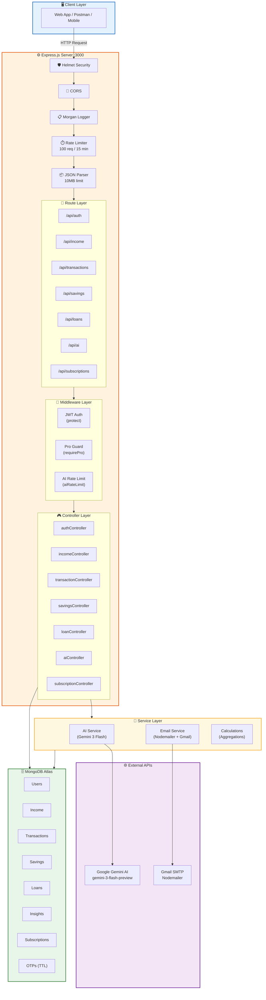
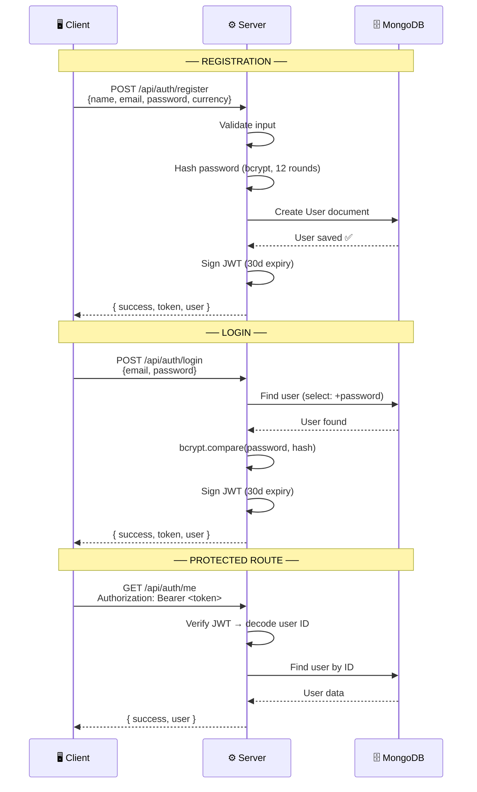
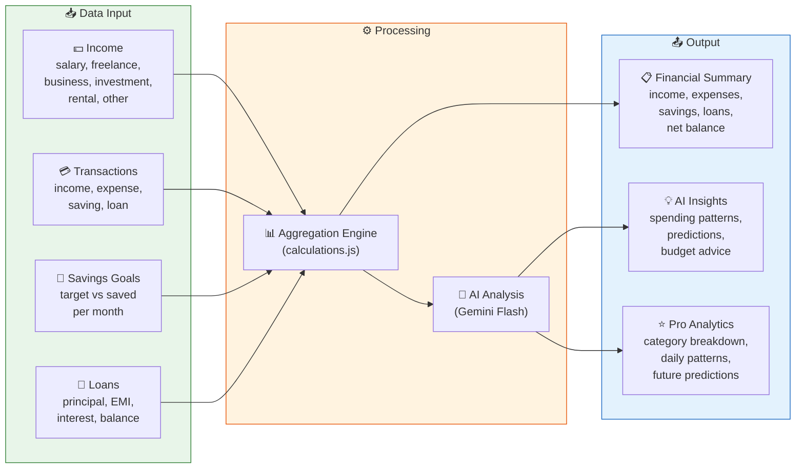
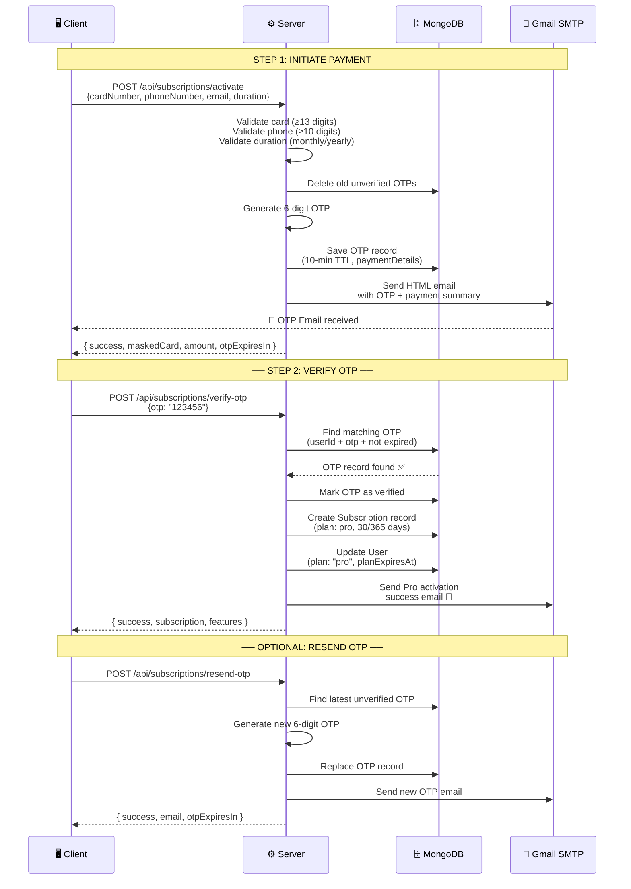
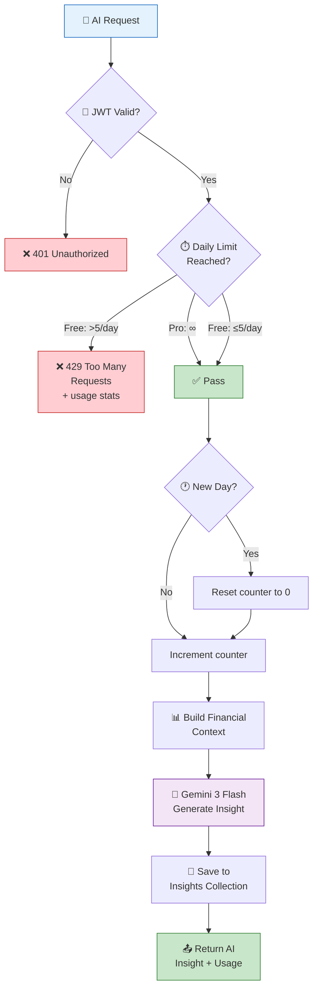
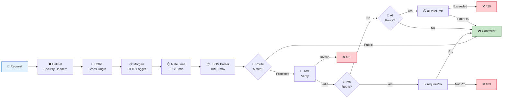
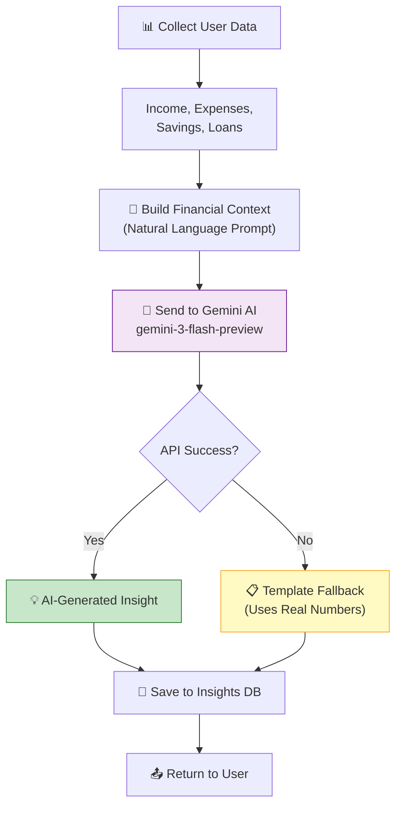
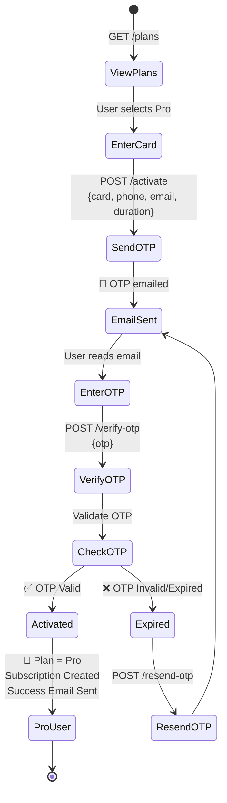
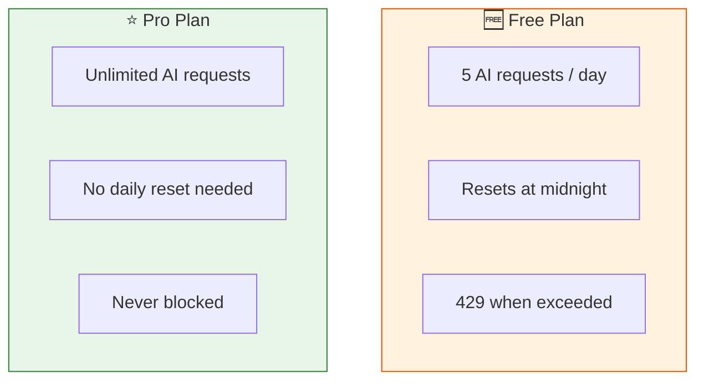
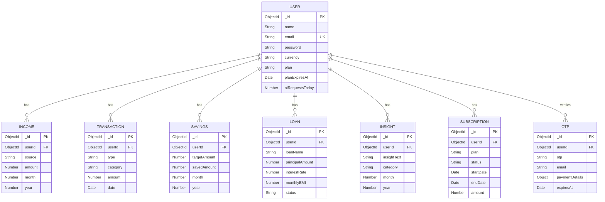

<p align="center">
  
  
  
  
  
  
</p>

# 🤖 AI Income Tracker — Backend API

> A full-featured **AI-powered financial tracking backend** with income/expense management, savings goals, loan tracking, AI-driven insights via **Google Gemini**, and a **Pro subscription system** with OTP-based email verification.

---

## 📑 Table of Contents

- [Architecture Overview](#-architecture-overview)
- [System Flow Diagrams](#-system-flow-diagrams)
- [Tech Stack](#-tech-stack)
- [Project Structure](#-project-structure)
- [Environment Variables](#-environment-variables)
- [Models (Database Schemas)](#-models-database-schemas)
- [Middleware](#-middleware)
- [Services](#-services)
- [Controllers](#-controllers)
- [API Routes](#-api-routes)
- [AI Integration](#-ai-integration)
- [Subscription & Payment System](#-subscription--payment-system)
- [Rate Limiting](#-rate-limiting)
- [Getting Started](#-getting-started)

---

## 🏛 Architecture Overview



---

## 🔄 System Flow Diagrams

### 🔐 Authentication Flow



### 💰 Financial Data Flow



### 🔑 OTP Payment & Pro Activation Flow



### 🤖 AI Request Pipeline



### 🛡️ Middleware Chain



---

## 🛠 Tech Stack

| Technology | Version | Purpose |
|------------|---------|---------|
| **Node.js** | 18+ | Runtime environment |
| **Express.js** | 5.2.1 | Web framework |
| **MongoDB Atlas** | Cloud | Database |
| **Mongoose** | 9.2.2 | ODM (Object Document Modeling) |
| **@google/genai** | 1.43.0 | Google Gemini AI SDK |
| **jsonwebtoken** | 9.0.3 | JWT authentication |
| **bcryptjs** | 3.0.3 | Password hashing |
| **nodemailer** | 8.0.1 | Email delivery (OTP) |
| **helmet** | 8.1.0 | Security headers |
| **cors** | 2.8.6 | Cross-origin support |
| **morgan** | 1.10.1 | HTTP request logger |
| **express-rate-limit** | 8.2.1 | API rate limiting |
| **dotenv** | 17.3.1 | Environment variables |
| **nodemon** | 3.1.14 | Dev auto-restart |

---

## 📁 Project Structure

```
backend/
├── config/
│   └── db.js                    # MongoDB Atlas connection
├── controllers/
│   ├── authController.js        # Register, Login, Profile
│   ├── incomeController.js      # Income CRUD
│   ├── transactionController.js # Transaction CRUD + pagination
│   ├── savingsController.js     # Savings upsert + query
│   ├── loanController.js        # Loan CRUD
│   ├── aiController.js          # AI chat, insights, Pro analytics
│   └── subscriptionController.js# OTP payment, Pro activation
├── middleware/
│   ├── authMiddleware.js        # JWT token verification
│   └── proMiddleware.js         # Pro guard + AI rate limiter
├── models/
│   ├── User.js                  # User schema + password hashing
│   ├── Income.js                # Income sources
│   ├── Transaction.js           # Income/Expense tracking
│   ├── Savings.js               # Monthly savings goals
│   ├── Loan.js                  # Loan tracking
│   ├── Insight.js               # AI-generated insights
│   ├── Subscription.js          # Pro plan subscriptions
│   └── OTP.js                   # OTP records (TTL auto-delete)
├── routes/
│   ├── authRoutes.js
│   ├── incomeRoutes.js
│   ├── transactionRoutes.js
│   ├── savingsRoutes.js
│   ├── loanRoutes.js
│   ├── aiRoutes.js
│   └── subscriptionRoutes.js
├── services/
│   ├── aiService.js             # Gemini AI integration
│   └── emailService.js          # Nodemailer OTP + success emails
├── utils/
│   └── calculations.js          # Financial aggregations
├── .env                         # Environment variables
├── package.json
├── README.md
└── server.js                    # App entry point
```

---

## 🔐 Environment Variables

Create a `.env` file in the `backend/` directory:

```env
# ── Server ──
PORT=3000

# ── Database ──
MONGO_URI=mongodb+srv://<user>:<pass>@cluster.mongodb.net/<dbname>

# ── Authentication ──
JWT_SECRET=your_super_secret_key_here
JWT_EXPIRES_IN=30d

# ── AI (Google Gemini) ──
GEMINI_API_KEY=your_gemini_api_key

# ── Email (Gmail SMTP — Nodemailer) ──
EMAIL_USER=your_email@gmail.com
EMAIL_PASS=your_gmail_app_password
```

> **Note:** For `EMAIL_PASS`, use a [Gmail App Password](https://myaccount.google.com/apppasswords), not your regular Gmail password.

---

## 📦 Models (Database Schemas)

### 👤 User

| Field | Type | Details |
|-------|------|---------|
| `name` | String | Required, max 100 chars |
| `email` | String | Required, unique, lowercase |
| `password` | String | Required, min 6, `select: false`, hashed (bcrypt 12 rounds) |
| `currency` | String | Enum: `USD, EUR, GBP, INR, JPY, CAD, AUD, PKR` — default `USD` |
| `plan` | String | Enum: `free, pro` — default `free` |
| `planExpiresAt` | Date | Pro plan expiration |
| `aiRequestsToday` | Number | Daily AI request counter |
| `aiRequestsResetAt` | Date | Counter reset timestamp |
| `timestamps` | Auto | `createdAt`, `updatedAt` |

**Methods:**
- `comparePassword(candidatePassword)` — bcrypt compare

---

### 💵 Income

| Field | Type | Details |
|-------|------|---------|
| `userId` | ObjectId | Ref → User, indexed |
| `source` | String | Enum: `salary, freelance, business, investment, rental, other` |
| `amount` | Number | Min: 0 |
| `month` | Number | 1–12 |
| `year` | Number | Min: 2000 |
| `notes` | String | Max 500 chars |

**Index:** `{ userId, year, month }` compound

---

### 💳 Transaction

| Field | Type | Details |
|-------|------|---------|
| `userId` | ObjectId | Ref → User, indexed |
| `type` | String | Enum: `income, expense, saving, loan` |
| `category` | String | Enum: `food, rent, shopping, investment, utilities, transport, healthcare, education, entertainment, salary, freelance, business, loan_payment, savings_deposit, other` |
| `amount` | Number | Min: 0 |
| `note` | String | Max 500 chars |
| `date` | Date | Default: `Date.now` |

**Indexes:** `{ userId, date: -1 }`, `{ userId, type, date: -1 }`

---

### 🎯 Savings

| Field | Type | Details |
|-------|------|---------|
| `userId` | ObjectId | Ref → User, indexed |
| `targetAmount` | Number | Min: 0 |
| `savedAmount` | Number | Default: 0, min: 0 |
| `month` | Number | 1–12 |
| `year` | Number | Min: 2000 |

**Index:** `{ userId, year, month }` — **unique** (one goal per month)  
**Virtual:** `progress` = `min((savedAmount / targetAmount) × 100, 100)`

---

### 🏦 Loan

| Field | Type | Details |
|-------|------|---------|
| `userId` | ObjectId | Ref → User, indexed |
| `loanName` | String | Max 200 chars |
| `principalAmount` | Number | Min: 0 |
| `interestRate` | Number | 0–100 |
| `monthlyEMI` | Number | Min: 0 |
| `remainingBalance` | Number | Min: 0 |
| `startDate` | Date | Loan start |
| `endDate` | Date | Loan end |
| `status` | String | Enum: `active, paid_off, defaulted` — default `active` |

**Virtual:** `totalInterest` = `max(EMI × totalMonths − principal, 0)`

---

### 💡 Insight

| Field | Type | Details |
|-------|------|---------|
| `userId` | ObjectId | Ref → User, indexed |
| `insightText` | String | AI-generated text |
| `category` | String | Enum: `spending, savings, budgeting, prediction, general` |
| `month` | Number | 1–12 |
| `year` | Number | Min: 2000 |

**Index:** `{ userId, year, month }`

---

### ⭐ Subscription

| Field | Type | Details |
|-------|------|---------|
| `userId` | ObjectId | Ref → User, indexed |
| `plan` | String | `"pro"` |
| `status` | String | Enum: `active, expired, cancelled` |
| `startDate` | Date | Activation date |
| `endDate` | Date | Expiration date |
| `amount` | Number | Payment amount |
| `currency` | String | Default: `USD` |
| `paymentMethod` | String | Enum: `card, upi, paypal, bank_transfer, other` |
| `transactionId` | String | Unique TX ID |

**Virtual:** `daysRemaining` = days until `endDate` (0 if not active)

---

### 🔢 OTP

| Field | Type | Details |
|-------|------|---------|
| `userId` | ObjectId | Ref → User |
| `email` | String | Recipient email |
| `otp` | String | 6-digit code |
| `purpose` | String | Enum: `pro_activation, verification` |
| `paymentDetails` | Object | `{ cardNumber, phoneNumber, duration, amount }` |
| `isVerified` | Boolean | Default: `false` |
| `expiresAt` | Date | **TTL Index** — auto-deletes expired OTPs |

---

## 🔐 Middleware

### `protect` — JWT Authentication

```
Authorization: Bearer <token>
       ↓
Extract token → jwt.verify(token, JWT_SECRET)
       ↓
Decode user ID → Fetch user from DB
       ↓
Attach req.user → next()
```

- Returns `401` if token missing, invalid, or user deleted

### `requirePro` — Pro Plan Guard

```
Check req.user.plan === "pro"
       ↓
Check planExpiresAt > Date.now()
       ↓
If expired → Auto-downgrade to free plan + save
       ↓
Returns 403 with upgrade information
```

### `aiRateLimit` — AI Usage Tracker

```
Is it a new day? → Reset aiRequestsToday to 0
       ↓
Check: aiRequestsToday < PLAN_LIMITS[plan].aiRequestsPerDay
       ↓
Free = 5/day │ Pro = Unlimited
       ↓
Increment counter → Attach usage stats to req
       ↓
Returns 429 with { used, limit, resetsAt } if exceeded
```

---

## 🔧 Services

### 🤖 AI Service (`aiService.js`)

| Function | Description |
|----------|-------------|
| `buildFinancialContext(userId, month, year)` | Fetches `monthlyFinancialSummary` and builds a natural-language prompt with all financial data |
| `generateInsight(userId, month, year)` | Calls **Gemini `gemini-3-flash-preview`** with the financial context and returns `{ insightText, category }` |

**Fallback:** If Gemini API fails, returns a template-based insight using actual numbers.

### 📧 Email Service (`emailService.js`)

| Function | Description |
|----------|-------------|
| `generateOTP()` | Returns a random 6-digit string |
| `sendOTPEmail(email, otp, userName, paymentDetails)` | Sends styled HTML email with OTP code, 10-min expiry, masked card, payment summary |
| `sendActivationSuccessEmail(email, userName, planDetails)` | Sends styled HTML confirmation with Pro features list, plan duration, expiry date |

**Transport:** Gmail SMTP via Nodemailer with App Password authentication.

### 📊 Calculations (`calculations.js`)

| Function | Description |
|----------|-------------|
| `totalIncome(userId, month, year)` | MongoDB aggregation `$sum` on Income collection |
| `totalExpenses(userId, month, year)` | Aggregates expense-type Transactions within date range |
| `totalSavings(userId, month, year)` | Reads `Savings.savedAmount` for the month |
| `loanPayments(userId)` | Sums `monthlyEMI` of all active loans |
| `savingsRate(income, savings)` | `(savings / income) × 100` as percentage string |
| `monthlyFinancialSummary(userId, month, year)` | Runs all above in parallel via `Promise.all` |

---

## 🎮 Controllers

### `authController`
| Function | Description |
|----------|-------------|
| `register` | Create user + hash password + return JWT |
| `login` | Verify credentials + return JWT |
| `getMe` | Return authenticated user's profile |

### `incomeController`
| Function | Description |
|----------|-------------|
| `addIncome` | Create income entry |
| `getIncome` | List income (filter: `?month=&year=&source=`) |
| `getIncomeById` | Get single income |
| `updateIncome` | Update income |
| `deleteIncome` | Delete income |

### `transactionController`
| Function | Description |
|----------|-------------|
| `createTransaction` | Create transaction |
| `getTransactions` | List with pagination (`?page=&limit=`), filters (`?type=&category=&startDate=&endDate=`) |
| `getTransactionById` | Get single transaction |
| `updateTransaction` | Update transaction |
| `deleteTransaction` | Delete transaction |

### `savingsController`
| Function | Description |
|----------|-------------|
| `upsertSavings` | Create or update savings goal (upsert by month/year) |
| `getSavings` | List savings (filter: `?month=&year=`) |
| `deleteSavings` | Delete savings goal |

### `loanController`
| Function | Description |
|----------|-------------|
| `addLoan` | Create loan |
| `getLoans` | List loans (filter: `?status=active/paid_off/defaulted`) |
| `getLoanById` | Get single loan |
| `updateLoan` | Update loan |
| `deleteLoan` | Delete loan |

### `aiController`
| Function | Description |
|----------|-------------|
| `chat` | Public — send any question to Gemini AI |
| `generateAndSaveInsight` | Generate AI insight from financial data + save to DB |
| `getInsights` | Get saved insights (filter: `?month=&year=`) |
| `getFinancialSummary` | Get monthly financial summary |
| `proAdvancedAnalytics` | **PRO** — Category breakdown + daily spending patterns |
| `proPredictExpenses` | **PRO** — AI predicts next month's expenses (JSON) |
| `proBudgetAdvice` | **PRO** — Personalized AI budget recommendations |

### `subscriptionController`
| Function | Description |
|----------|-------------|
| `getPlans` | Public — Free vs Pro comparison with pricing |
| `getPlanStatus` | Current plan, expiry, AI usage, features |
| `activatePro` | **Step 1** — Validate card/phone/email → send OTP |
| `verifyOTPAndActivate` | **Step 2** — Verify OTP → activate Pro |
| `resendOTP` | Resend OTP (generates new 6-digit code) |
| `cancelSubscription` | Cancel Pro (features active until expiry) |
| `getSubscriptionHistory` | List all past subscriptions |

---

## 📡 API Routes

### 🔑 Auth — `/api/auth`

| Method | Endpoint | Auth | Description |
|--------|----------|------|-------------|
| `POST` | `/api/auth/register` | 🌐 Public | Register new user |
| `POST` | `/api/auth/login` | 🌐 Public | Login |
| `GET` | `/api/auth/me` | 🔐 Protected | Get profile |

**Request — Register:**
```json
{
  "name": "zuniad",
  "email": "zuniad@gmail.com",
  "password": "zuniad123$",
  "currency": "INR"
}
```

**Response:**
```json
{
  "success": true,
  "token": "eyJhbGciOi...",
  "user": { "id": "...", "name": "zuniad", "email": "zuniad@gmail.com", "currency": "INR" }
}
```

---

### 💵 Income — `/api/income`

| Method | Endpoint | Auth | Description |
|--------|----------|------|-------------|
| `POST` | `/api/income` | 🔐 | Add income |
| `GET` | `/api/income` | 🔐 | List income (`?month=&year=&source=`) |
| `GET` | `/api/income/:id` | 🔐 | Get single |
| `PUT` | `/api/income/:id` | 🔐 | Update |
| `DELETE` | `/api/income/:id` | 🔐 | Delete |

**Request — Add Income:**
```json
{
  "source": "salary",
  "amount": 75000,
  "month": 3,
  "year": 2026,
  "notes": "March salary"
}
```

---

### 💳 Transactions — `/api/transactions`

| Method | Endpoint | Auth | Description |
|--------|----------|------|-------------|
| `POST` | `/api/transactions` | 🔐 | Add transaction |
| `GET` | `/api/transactions` | 🔐 | List (paginated + filtered) |
| `GET` | `/api/transactions/:id` | 🔐 | Get single |
| `PUT` | `/api/transactions/:id` | 🔐 | Update |
| `DELETE` | `/api/transactions/:id` | 🔐 | Delete |

**Query Params:** `?page=1&limit=20&type=expense&category=food&startDate=2026-03-01&endDate=2026-03-31`

**Request — Add Transaction:**
```json
{
  "type": "expense",
  "category": "food",
  "amount": 500,
  "note": "Lunch at restaurant",
  "date": "2026-03-01"
}
```

---

### 🎯 Savings — `/api/savings`

| Method | Endpoint | Auth | Description |
|--------|----------|------|-------------|
| `POST` | `/api/savings` | 🔐 | Create/update savings goal (upsert) |
| `GET` | `/api/savings` | 🔐 | List (`?month=&year=`) |
| `DELETE` | `/api/savings/:id` | 🔐 | Delete |

**Request — Upsert Savings:**
```json
{
  "targetAmount": 10000,
  "savedAmount": 3500,
  "month": 3,
  "year": 2026
}
```

---

### 🏦 Loans — `/api/loans`

| Method | Endpoint | Auth | Description |
|--------|----------|------|-------------|
| `POST` | `/api/loans` | 🔐 | Add loan |
| `GET` | `/api/loans` | 🔐 | List (`?status=active`) |
| `GET` | `/api/loans/:id` | 🔐 | Get single |
| `PUT` | `/api/loans/:id` | 🔐 | Update |
| `DELETE` | `/api/loans/:id` | 🔐 | Delete |

**Request — Add Loan:**
```json
{
  "loanName": "Car Loan",
  "principalAmount": 500000,
  "interestRate": 8.5,
  "monthlyEMI": 10500,
  "remainingBalance": 480000,
  "startDate": "2025-01-01",
  "endDate": "2029-01-01"
}
```

---

### 🤖 AI — `/api/ai`

| Method | Endpoint | Auth | Description |
|--------|----------|------|-------------|
| `POST` | `/api/ai/chat` | 🌐 Public | Chat with Gemini AI |
| `POST` | `/api/ai/generate` | 🔐 + ⏱️ Rate Limited | Generate financial insight |
| `GET` | `/api/ai/insights` | 🔐 | Get saved insights |
| `GET` | `/api/ai/summary` | 🔐 | Financial summary |
| `GET` | `/api/ai/pro/analytics` | 🔐 + ⭐ Pro | Advanced analytics |
| `POST` | `/api/ai/pro/predict` | 🔐 + ⭐ Pro | Expense predictions |
| `POST` | `/api/ai/pro/budget-advice` | 🔐 + ⭐ Pro | Budget recommendations |

**Request — AI Chat:**
```json
{ "message": "How can I save more money each month?" }
```

**Request — Generate Insight:**
```json
{ "month": 3, "year": 2026 }
```

---

### ⭐ Subscriptions — `/api/subscriptions`

| Method | Endpoint | Auth | Description |
|--------|----------|------|-------------|
| `GET` | `/api/subscriptions/plans` | 🌐 Public | View plans & pricing |
| `GET` | `/api/subscriptions/status` | 🔐 | Current plan status |
| `POST` | `/api/subscriptions/activate` | 🔐 | Step 1: Send OTP |
| `POST` | `/api/subscriptions/verify-otp` | 🔐 | Step 2: Verify & activate |
| `POST` | `/api/subscriptions/resend-otp` | 🔐 | Resend OTP |
| `POST` | `/api/subscriptions/cancel` | 🔐 | Cancel subscription |
| `GET` | `/api/subscriptions/history` | 🔐 | Subscription history |

**Request — Activate (Step 1):**
```json
{
  "duration": "yearly",
  "cardNumber": "4901490149014901",
  "phoneNumber": "7410852096",
  "email": "user@gmail.com"
}
```

**Request — Verify OTP (Step 2):**
```json
{ "otp": "329793" }
```

---

## 🤖 AI Integration

### Google Gemini Setup

```
SDK: @google/genai (GoogleGenAI class)
Model: gemini-3-flash-preview
```

### How AI Insights Work



### AI Features by Plan

| Feature | Free Plan | Pro Plan |
|---------|-----------|----------|
| **AI Chat** | ✅ Unlimited | ✅ Unlimited |
| **Financial Insights** | ✅ 5/day | ✅ Unlimited |
| **Insight History** | Last 10 | Unlimited |
| **Advanced Analytics** | ❌ | ✅ Category breakdown + daily patterns |
| **Expense Predictions** | ❌ | ✅ AI predicts next month (JSON) |
| **Budget Advice** | ❌ | ✅ Personalized recommendations |

### Pro AI Endpoints Deep Dive

**`proAdvancedAnalytics`** — Runs MongoDB aggregation for:
- Category-wise expense breakdown (amount + percentage)
- Daily spending pattern (date → total)
- Top spending category identification

**`proPredictExpenses`** — Collects 3 months of historical data, sends structured prompt to Gemini requesting JSON output with:
- Predicted category-wise amounts
- Savings goal suggestions
- Spending warnings

**`proBudgetAdvice`** — Builds detailed prompt with category data + optional user goal, asks Gemini for:
- Dollar/₹-specific budget allocation per category
- Debt repayment timeline
- Emergency fund guidance
- Actionable weekly/monthly steps

---

## 💳 Subscription & Payment System

### Plan Pricing

| Plan | Monthly | Yearly | Savings |
|------|---------|--------|---------|
| **Free** | $0 | $0 | — |
| **Pro** | $9.99/mo | $99.99/yr | 17% |

### OTP Payment Flow



### Security Measures

- ✅ Card number masked in responses (`**** **** **** 1234`)
- ✅ OTP expires in **10 minutes** (MongoDB TTL auto-delete)
- ✅ Old unverified OTPs deleted before generating new one
- ✅ OTP marked as verified after use (prevents reuse)
- ✅ JWT required for all payment endpoints
- ✅ Payment details stored in OTP record (not exposed in responses)

---

## ⏱ Rate Limiting

### Global Rate Limiter

```
Window: 15 minutes
Max Requests: 100 per IP
Applies to: All /api/* routes
Response on exceed: 429 Too Many Requests
```

### AI-Specific Rate Limiter



**Rate Limit Response (429):**
```json
{
  "success": false,
  "message": "Daily AI request limit reached. Upgrade to Pro for unlimited access.",
  "usage": {
    "used": 5,
    "limit": 5,
    "resetsAt": "2026-03-02T00:00:00.000Z",
    "plan": "free"
  }
}
```

---

## 🚀 Getting Started

### Prerequisites

- **Node.js** 18+
- **MongoDB Atlas** account (or local MongoDB)
- **Google Cloud** account with Gemini API key
- **Gmail** account with App Password enabled

### Installation

```bash
# 1. Clone the repository
git clone <repo-url>
cd "Income Tracker/backend"

# 2. Install dependencies
npm install

# 3. Create .env file (see Environment Variables section)
cp .env.example .env

# 4. Start development server
npm run dev

# 5. Or start production server
npm start
```

### Verify Server

```bash
# Health check
curl http://localhost:3000/

# Expected response:
# { "success": true, "message": "AI Income Tracker API is running" }
```

### Quick Test Flow

```bash
# 1. Register
curl -X POST http://localhost:3000/api/auth/register \
  -H "Content-Type: application/json" \
  -d '{"name":"test","email":"test@email.com","password":"pass123","currency":"USD"}'

# 2. Use the returned token for all protected routes
# Authorization: Bearer <token>

# 3. Chat with AI (no auth needed)
curl -X POST http://localhost:3000/api/ai/chat \
  -H "Content-Type: application/json" \
  -d '{"message":"How to budget better?"}'

# 4. View Pro plans
curl http://localhost:3000/api/subscriptions/plans
```

---

## 📊 Database Relationships



---

<p align="center">
  <b>Built with ❤️ by Zuniad Ahammad</b>
  <br/>
  <sub>AI Income Tracker — Smart financial management powered by Google Gemini AI</sub>
</p>
